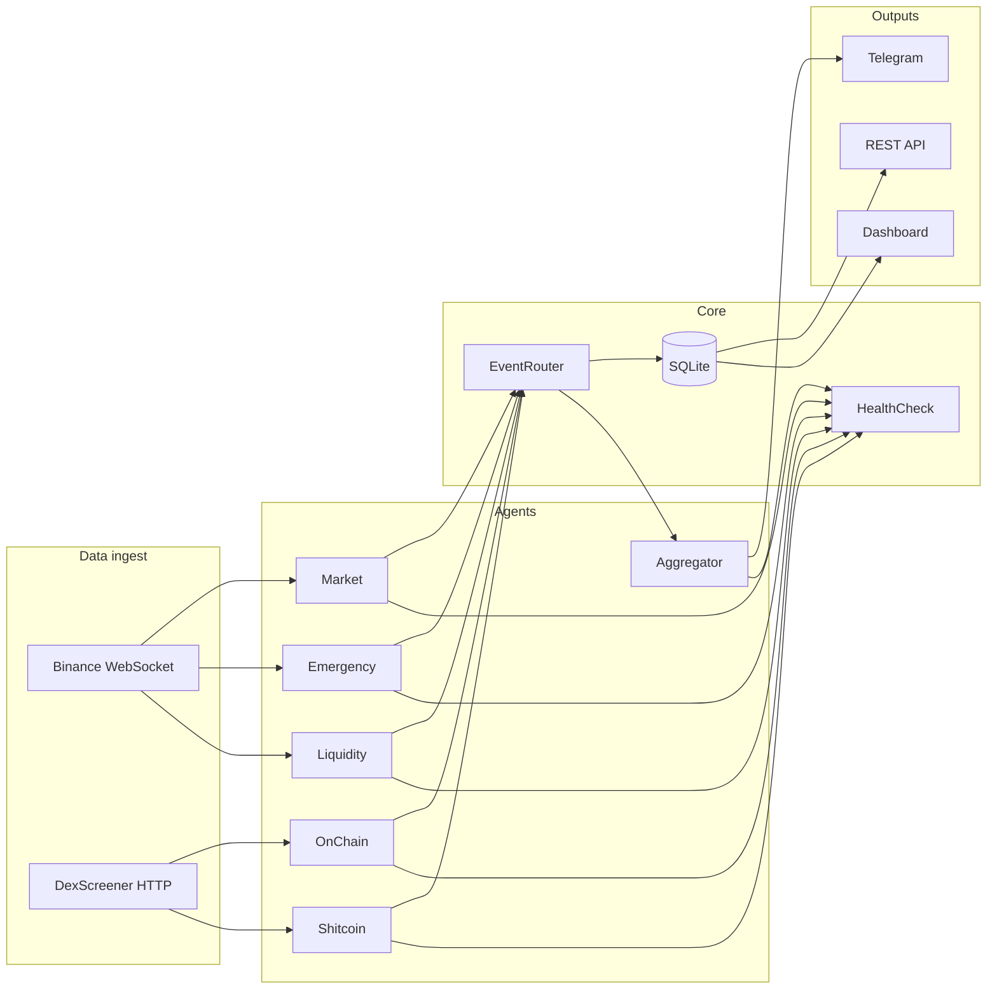

# Multi-Agent Crypto Analytics

A **Python-based monitoring and alerting platform** for cryptocurrency markets. It continuously ingests public market data (primarily from **Binance**), runs several **specialized analysis agents** in parallel, stores findings in **SQLite**, optionally pushes **rich Telegram messages**, and exposes a **REST API** plus a **browser dashboard** for review and export.

**Important:** this is **not** a turnkey “press button to trade” bot. It does **not** place or manage orders on your behalf. It produces **signals, context, and summaries** so you or your trading stack can decide what to do next.

---

## What you get (client-facing overview)

| Area | What it does |
|------|----------------|
| **Live market data** | WebSocket streams for **candles (klines)**, **order book depth**, and **trades** for a configurable list of symbols (e.g. `BTCUSDT`, `ETHUSDT`). |
| **Multi-agent analysis** | Six logical “workers” each look at different aspects of the market (trend/volatility, DEX-style activity, book liquidity, high-risk pairs, fast moves, and a final blend). |
| **Signal bus** | All agents publish into a central **event router** that persists every signal and forwards it to the **aggregator** (and optionally legacy direct Telegram paths). |
| **Decision-style output** | The **aggregator** scores recent signals per symbol and may emit consolidated hints such as **BUY / SELL / EXIT / WAIT** with confidence, risk tier, and short reasons (display only — not personalized investment advice). |
| **Persistence** | **SQLite** database for signals, candles, optional whale/liquidity/anomaly tables — suitable for a single node or small deployment. |
| **Operator UI** | **Web dashboard** with filters, charts, recent signal table, JSON export hooks. |
| **Integration** | **OpenAPI**-documented **REST API** for dashboards, cron jobs, or downstream automation you build yourself. |
| **Alerts** | **Telegram** is the main delivery channel; **Discord** and **Email** helper modules exist for custom wiring. |

---

## Architecture at a glance



---

## Agents in detail

Each agent runs asynchronously alongside the others. They **emit structured signals** (agent name, signal type, priority, message, symbol, optional JSON payload).

### 1. Market Agent (`agents/market_agent.py`)

- Connects to **Binance** combined WebSocket streams.
- Maintains rolling **candles**, **order books**, and **recent trades** per symbol.
- Periodically runs **lightweight technical heuristics** (trend, volatility, volume vs average, rough support/resistance).
- Example signal families: **volume spikes**, **high volatility**, **support/resistance breaks**.

### 2. OnChain Agent (`agents/onchain_agent.py`)

- Uses **public DEX metadata** (via **DexScreener**-style HTTP APIs) rather than a full archival blockchain node.
- Surfaces **large relative volume / “whale-sized” activity** style alerts on liquid pairs it can see through that API.
- Best thought of as **liquidity and flow radar**, not a certified on-chain forensics tool.

### 3. Liquidity Agent (`agents/liquidity_agent.py`)

- Reads **local order book snapshots** produced by the Market Agent.
- Detects **bid/ask imbalance**, clusters of resting liquidity, and **stop-cluster-style** pockets (heuristic, not exchange-confirmed stop orders).

### 4. Shitcoin / DEX scanner (`agents/shitcoin_agent.py`)

- Polls DEX pair lists for **extreme moves**, thin liquidity, and rapid **pump/dump** style patterns.
- Flags **high-risk** meme or low-cap dynamics; useful for **awareness**, not as a standalone buy signal.

### 5. Emergency Agent (`agents/emergency_agent.py`)

- Short-interval pass over Market Agent buffers.
- Fires on **sudden volume spikes**, **sharp price moves**, **very thin books**, and **cascade sell patterns** (consecutive down candles with rising volume).
- Priorities are tuned so **urgent / critical** items surface quickly.

### 6. Aggregator Agent (`agents/aggregator_agent.py`)

- Consumes the **recent signal window** per symbol from all agents.
- Applies **weights** by agent, signal type, and priority, then deduplicates and thresholds against `min_confidence` from config.
- Formats **HTML Telegram messages** with confidence, risk, reasons, and optional price context.
- Sends **hourly summary** messages when there is activity to report.

---

## Core services (shared infrastructure)

| Module | Role |
|--------|------|
| `core/event_router.py` | Async queue: **save signal → call aggregator → optional Telegram**. |
| `core/database.py` | Async-friendly SQLite access: candles, signals, whale rows, anomalies, liquidity zones. |
| `core/metrics.py` | Counters / aggregates for dashboards and API. |
| `core/health_check.py` | Registers running agents for **liveness-style** monitoring. |
| `core/websocket_manager.py` | Binance stream helpers / reconnection logic used by the Market Agent. |
| `core/analytics.py` | Helpers consumed by the enhanced dashboard (historical slices, stats). |
| `core/utils.py` | Shared validation, stable-coin checks, retry decorator. |
| `core/logger.py` | Rotating file + console logging. |

---

## Web dashboard (`web/dashboard_enhanced.py`)

- Single-page **dark UI** with **Chart.js** graphs.
- **Filters:** time window, agent, signal type, free-text search on symbol/message.
- **Stats cards:** totals, window counts, agent activity, average confidence (where available).
- **Tables:** latest signals with timestamp, symbol, action/type, price, confidence, risk, source agent.
- **Export:** opens JSON export endpoint for the selected window (browser download).
- **WebSocket:** pushes refreshed dashboard payload on an interval while the page is open.

Default URL: **http://localhost:8000**

---

## REST API (`web/api.py`)

FastAPI application with auto-generated docs.

- **Signals:** list, filter, paginate, fetch by id.
- **Metrics:** system counters and compact summaries.
- **Agents:** static catalog describing each agent’s role (for UI labels).
- **Candles:** query recent OHLCV for a symbol/timeframe stored locally.
- **Export:** CSV / JSON dumps of signal history.
- **Search:** simple text / field search over stored signals.
- **Statistics:** per-symbol counts and placeholder performance hooks.

Default base URL: **http://localhost:8001** — interactive docs: **http://localhost:8001/docs**

---

## Notifications (`bot/`)

- **`TelegramBot`** — HTML-formatted **signal** and **report** messages; primary user-facing channel.
- **`discord_notifier.py` / `email_notifier.py`** — optional; wire them in your own code or extensions if you need multi-channel delivery.

---

## Configuration

1. Copy the template and adjust, **or** rely purely on environment variables (see `config.py.example`).

```bash
copy config.py.example config.py
```

On Linux/macOS:

```bash
cp config.py.example config.py
```

2. **Minimum for Telegram:**

| Variable | Description |
|----------|-------------|
| `TELEGRAM_BOT_TOKEN` | From [@BotFather](https://t.me/BotFather) |
| `TELEGRAM_CHAT_ID` | Your user, group, or channel id |

3. **Optional:** `LOG_LEVEL` (default `INFO`), symbol list and thresholds live in the `Config` dataclasses in `config.py` / example file (e.g. volume spike multiplier, min confidence, aggregation interval).

`config.py` is **gitignored** — never commit real tokens.

---

## How to run

**Core pipeline (agents + router + health checks):**

```bash
python main.py
```

**REST API** (port `8001` by default):

```bash
python web/api.py
```

**Dashboard** (port `8000` by default):

```bash
python web/dashboard_enhanced.py
```

**Windows:** `START.bat` launches API and dashboard in separate console windows, then runs `main.py` in the current window.

---

## Repository layout

```
agents/          # All analysis agents
bot/             # Telegram / Discord / Email helpers
core/            # DB, routing, metrics, health, WebSocket helpers, analytics, logging
web/             # FastAPI API + enhanced dashboard
tests/           # Pytest smoke tests
main.py          # Orchestrates agents + router + optional Telegram
config.py        # Local secrets & tuning (not in git — use example as template)
```

---

## Tests

```bash
pytest
```

Smoke tests cover imports, a SQLite signal round-trip, config example validity, and aggregator reason extraction.

---

## Utility scripts

| Script | Purpose |
|--------|---------|
| `check_system_status.py` | Quick dependency, config, DB, log folder, and port check. |
| `check_agents.py` | Rich printout of DB activity by agent and symbol. |
| `check_signals.py` | Signal counts, Telegram sent flags, stable-coin noise notes. |
| `test_run.py` | Long-running dry run with **mock** Telegram (console only). |
| `get_chat_id.py` | Resolve chat id after you message the bot (`TELEGRAM_BOT_TOKEN` required in env). |
| `setup_telegram.py` | Interactive flow that can write `.env` with token + chat id. |
| `test_telegram_send.py` | Sends one test message using `config.py` / env. |

---

## Requirements

- **Python 3.10+**
- Install: `pip install -r requirements.txt`

---

## Limitations (set expectations with clients)

- **No order execution** — no Binance signed orders, no portfolio sync, no position sizing engine in-tree.
- **Public data bias** — quality depends on **Binance public streams** and **third-party HTTP APIs** (rate limits, outages, geographic restrictions).
- **Heuristics, not guarantees** — signals are **rule-based scores**, not a verified predictive model; false positives are expected in volatile markets.
- **Single-node SQLite** — great for one server; for heavy multi-user SaaS you would likely migrate storage and add auth layers yourself.
- **Regulatory / compliance** — operators remain responsible for how alerts are used; this README is **not financial advice**.

---

## License / disclaimer

Use at your own risk. **Not financial advice.** Past signal frequency does not imply future performance.
